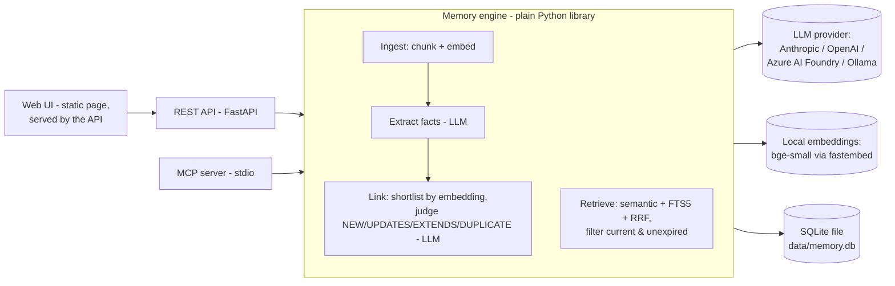

# Elephantus


**A small, local memory layer for AI apps.** You send it messages and it pulls out short facts
about the user. It links each new fact to the ones it already has and keeps track of what is
*currently true*. You can use it from a REST API, from Claude Desktop (MCP), or from a demo UI.

> **RAG finds similar text. Memory tracks what is *currently true* about a user.**

*An elephant never forgets, but it does know which of its memories are out of date.*

<video src="https://github.com/user-attachments/assets/8d86963d-b060-4939-b358-aad85b4f94de" controls width="100%">
  Your browser does not support the video tag.
</video>

---

## Contents

- [The idea: memory vs RAG](#the-idea-memory-vs-rag)
- [Architecture](#architecture)
- [Quickstart](#quickstart)
- [Demo walkthrough](#demo-walkthrough)
- [REST API](#rest-api)
- [Claude Desktop (MCP)](#claude-desktop-mcp)
- [Evaluation](#evaluation)
- [Design decisions](#design-decisions)
- [Limitations](#limitations)
- [Project layout & tests](#project-layout--tests)

---

## The idea: memory vs RAG

Suppose a user tells an assistant three things over time:

1. "I love Adidas sneakers"
2. "My Adidas broke after a month"
3. "I'm switching to Puma"

Later the user asks, **"What sneakers should I buy?"**

- **Naive RAG** stores the raw messages and fetches the ones most *similar* to the question.
  "I love Adidas sneakers" is the closest match (it even contains the word *sneakers*), so the
  assistant recommends **Adidas** ❌. Similarity says nothing about whether a fact is still true.
- **Memory** turns each message into atomic facts and compares every new fact with what it
  already knows. "User is switching to Puma" **UPDATES** "User loves Adidas sneakers". The old
  fact is marked outdated: it's kept for history but never retrieved again. The assistant
  recommends **Puma** ✅.

### What the engine does

| Concept | In this project |
|---|---|
| **Documents vs memories** | Raw messages are stored and chunked (for the RAG baseline). An LLM extracts short, atomic **memories** from them. |
| **Container tags** | Every document and memory belongs to a `container_tag` (e.g. `khan`, `work`). Tags never mix, not even during linking. |
| **Relationships** | Each new fact is compared with the most similar *current* memories and labelled `NEW`, `UPDATES` (the old fact becomes `is_latest = false` and an edge is stored), `EXTENDS` (both stay current and an edge is stored) or `DUPLICATE` (skipped). Every decision is logged. |
| **Kinds** | `static` (long-term: where you study, lasting preferences) vs `dynamic` (recent or ongoing: this week's project). |
| **Forgetting** | Time-bound facts ("exam tomorrow") get an expiry when they are extracted and drop out of retrieval once it passes. A **simulated "now"** (`time_offset_hours`) lets you demo this without waiting. You can also forget a fact explicitly. |
| **Hybrid search** | Embedding similarity + SQLite FTS5 keyword search, merged with **Reciprocal Rank Fusion**. Only current, unexpired memories are searched. |
| **Profile** | One call returns `static` facts, recent `dynamic` facts and, optionally, search results for a query. |

---

## Architecture



- `elephantus/engine.py` is the **engine**. It knows nothing about HTTP, MCP or the UI.
- `api.py` and `mcp_server.py` are thin layers over the **same engine and the same
  SQLite file**, so a fact saved from Claude Desktop shows up in the UI straight away.

**What happens when you add a message:**

```
"I'm switching to Puma"
  │ 1. store document, chunk, embed chunks          (RAG baseline data)
  │ 2. LLM extracts facts → "User is switching to Puma sneakers" (dynamic, no expiry)
  │ 3. embed fact, shortlist the 5 most similar CURRENT memories in this container
  │ 4. LLM judges → UPDATES "User loves Adidas sneakers"
  ▼ 5. insert new memory, mark old is_latest=0, add edge new→old, log the decision
```

---

## Quickstart

### Requirements

1. **Python 3.11+**
2. **One** of these:
   - an **Anthropic** API key, or
   - an **OpenAI** API key, or
   - a model deployed in **Azure AI Foundry** (API key or Entra ID), or
   - **[Ollama](https://ollama.com)** installed locally (no key, fully offline), e.g. `ollama pull qwen2.5:7b`
3. *(Optional)* **Claude Desktop**, for the MCP part of the demo

The embedding model (~70 MB) downloads automatically the first time it's needed, and the
database file is created automatically. Nothing else to install.

### Install (one command)

```bash
git clone https://github.com/akramlodi/elephantus.git && cd elephantus
python -m venv .venv && source .venv/bin/activate      # Windows: .venv\Scripts\activate
pip install -e ".[dev]"
```

<details>
<summary><b>macOS: <code>ModuleNotFoundError: No module named 'elephantus'</code> after installing</b></summary>

Python 3.13+ ignores `.pth` files that have the macOS "hidden" flag, and the editable install
relies on one. Clear the flag and the command works again:

```bash
chflags -R nohidden .venv
```

The usual cause is iCloud "Desktop & Documents" sync, which keeps re-applying the flag to
projects in `~/Desktop` or `~/Documents`, so the error comes back on its own. The permanent fix
is to keep the project outside those folders (e.g. `~/projects`) and recreate the venv there.
</details>

### Configure

```bash
cp .env.example .env        # Windows: copy .env.example .env
```

Edit `.env` and set **one** provider:

```ini
LLM_PROVIDER=anthropic          # or: openai | ollama | azure
ANTHROPIC_API_KEY=sk-ant-...    # or OPENAI_API_KEY=..., or nothing for Ollama
LLM_MODEL=                      # empty = default (claude-opus-5-5 / gpt-4o-mini / qwen2.5:7b)
```

Check that the provider works:

```bash
elephantus check
```

<details>
<summary><b>Using a model from Azure AI Foundry</b></summary>

Copy the endpoint from your Foundry project page. The project endpoint works as-is; it is
converted to the OpenAI-compatible `https://<resource>.services.ai.azure.com/openai/v1` URL.
`LLM_MODEL` is your **deployment name** (shown under *Models + endpoints*), not the model family.

```ini
LLM_PROVIDER=azure
AZURE_ENDPOINT=https://<resource>.services.ai.azure.com/api/projects/<project>
AZURE_API_KEY=<key from the Foundry portal>
LLM_MODEL=gpt-4o                # your deployment name
```

To sign in with your Azure identity instead of a key (`az login`, managed identity, ...), set
`AZURE_USE_ENTRA_ID=true`, leave `AZURE_API_KEY` empty and install the extra:
`pip install -e ".[azure]"`. Your identity needs a role such as *Azure AI User* on the resource.

Any chat model deployed in Foundry should work (GPT-4o, GPT-4.1, o-series, gpt-5, and partner
models served through the same endpoint). For reasoning models (o-series, gpt-5),
`temperature` is not sent.
</details>

If the configuration is wrong you get a plain explanation instead of a stack trace, for example
`LLM_PROVIDER=anthropic but ANTHROPIC_API_KEY is empty...` or
`Could not reach Ollama. Is it running (ollama serve)...`.

### Run (one command)

```bash
elephantus start
```

This starts the server on http://127.0.0.1:8000 and opens the **web UI** in your browser.
The same server hosts the **REST API** (interactive docs at `/docs`). Add `--no-browser` to skip
opening a tab. The MCP server runs separately: `elephantus mcp`, and Claude Desktop launches it for you.

| Command | What it does |
|---|---|
| `elephantus check` | Round-trip a prompt to the configured LLM |
| `elephantus start` (alias `elephantus ui`) | Web UI + REST API, opens the browser |
| `elephantus api` | Same server, without opening a browser |
| `elephantus mcp` | MCP server over stdio (Claude Desktop launches this for you) |
| `elephantus eval [--offline] [--k 3]` | Run the evaluation |

---

## Demo walkthrough

The UI is a dark, terminal-style page in the spirit of [opencode.ai](https://opencode.ai). Tabs
across the top switch views: **chat · memories · graph · profile · search · eval · log**. Keys
`1`–`7` also switch tabs, and `/` jumps to the chat prompt. A status sidebar on the right holds:

- the **container** tag
- the **clock**, for simulating time
- **context** counts
- the live **memory** list
- options and provider info
- **reset container**

These steps follow the north-star flow from the brief. Everything happens in the UI.

1. Run `elephantus start`; the browser opens http://127.0.0.1:8000/.
2. In the sidebar under **Container**, pick or type a tag (e.g. `khan`) and press Enter.
3. In the **chat** tab, type at the `❯` prompt:
   - `I love Adidas sneakers`
   - `My Adidas broke after a month`
   - `I'm switching to Puma`
4. Each message gets a tree of linking decisions, like a coding agent's tool calls
   (`NEW`, `EXTENDS` in blue, `UPDATES` in red, `DUPLICATE`). The sidebar's **Memory** list
   updates live, and "User loves Adidas sneakers" is **struck through**. The **graph** tab draws
   the red `UPDATES` edge.
5. Ask **`What sneakers should I buy?`**. Two boxes appear side by side: **rag · similarity
   only** and **memory · current facts**. Expand "context used" in each to see *why* they differ.
   *Tip:* **⤓ Load sample** (top right) loads a longer, Adidas-heavy history. In that history,
   chunk similarity clearly favours the stale Adidas messages, which makes the contrast obvious.
6. The **profile** tab shows **static** vs **dynamic** facts and the exact context prompt.
   The **search** tab runs the same query in `memories`, `documents` (RAG) or `hybrid` mode.
7. **Forgetting:** send `I have an exam tomorrow`, then drag the **Clock** slider to `+72h`.
   The memory turns *expired* and disappears from answers, the profile and search.
   The **memories** tab can also **forget** any current fact explicitly.
8. **Claude Desktop:** see [below](#claude-desktop-mcp). In a brand-new chat, ask *"What do you
   know about my shoe preferences?"*. Claude calls `recall` and answers from the same store.
9. The **eval** tab shows the RAG-vs-memory results table with terminal-style bar charts.
   The **log** tab lists every linking decision and the raw documents.
   **✕ reset container** wipes the tag so you can start over.

Under **Options** in the sidebar you can skip the side-by-side answers (faster ingestion) or stop
remembering chat messages. The chat history for each container is kept in your browser
(localStorage); the memories themselves live in the SQLite file.

---

## REST API

Full interactive docs are at http://127.0.0.1:8000/docs. The core calls are `add`, `search`
and `profile`.

| Method & path | Purpose |
|---|---|
| `GET /health` | Status, provider, model, embedding backend |
| `POST /v1/add` | Store content under a tag; extract and link memories (`extract: false` skips the LLM) |
| `POST /v1/search` | `mode`: `memories` (default, hybrid over current facts), `documents` (naive RAG baseline), `hybrid` (both) |
| `POST /v1/profile` | `{static, dynamic}` + `search_results` when `q` is given |
| `POST /v1/chat` | Answers twice (RAG vs memory) and returns the context each one used |
| `POST /v1/forget` | Forget by `memory_id`, or the best match for `content` |
| `GET /v1/containers` | List container tags |
| `GET /v1/containers/{tag}/memories` | All memories with status `current` / `outdated` / `expired` / `forgotten` |
| `GET /v1/containers/{tag}/graph` | Nodes + `UPDATES` / `EXTENDS` edges |
| `GET /v1/containers/{tag}/log` | Linking decisions |
| `GET /v1/containers/{tag}/documents` | Raw documents |
| `DELETE /v1/containers/{tag}` | Reset a container |

The search, profile, chat and memory-listing endpoints accept `time_offset_hours` to simulate
the future.

```bash
curl -s localhost:8000/v1/add -H 'content-type: application/json' \
  -d '{"content": "I am switching to Puma", "container_tag": "khan"}'

curl -s localhost:8000/v1/search -H 'content-type: application/json' \
  -d '{"q": "What sneakers should I buy?", "container_tag": "khan", "mode": "memories"}'

curl -s localhost:8000/v1/profile -H 'content-type: application/json' \
  -d '{"container_tag": "khan", "q": "sneakers", "time_offset_hours": 72}'
```

---

## Claude Desktop (MCP)

The MCP server exposes three tools:

| Tool | What it does |
|---|---|
| `memory(content, action="save" \| "forget", container_tag?)` | Save information (extract + link), or forget the best-matching memory |
| `recall(query, container_tag?, limit?)` | Search current memories, plus a profile summary |
| `context(container_tag?)` | The full profile, to inject at the start of a conversation |

**Setup:** open Claude Desktop → *Settings → Developer → Edit Config*. The config file lives at
`~/Library/Application Support/Claude/claude_desktop_config.json` on macOS and
`%APPDATA%\Claude\claude_desktop_config.json` on Windows. Add the following, using **absolute
paths** to your clone:

```json
{
  "mcpServers": {
    "elephantus": {
      "command": "/ABSOLUTE/PATH/TO/elephantus/.venv/bin/python",
      "args": ["-m", "elephantus.mcp_server"],
      "env": {
        "ELEPHANTUS_ENV_FILE": "/ABSOLUTE/PATH/TO/elephantus/.env",
        "DEFAULT_CONTAINER_TAG": "khan"
      }
    }
  }
}
```

On Windows, use `C:\\path\\to\\elephantus\\.venv\\Scripts\\python.exe` as the command.
Restart Claude Desktop, and the three tools appear under the 🔧 icon.

- `DEFAULT_CONTAINER_TAG` should match the tag you use in the UI, so both see the same memories.
- The database path from `.env` resolves relative to the project root. That means the MCP
  server, the API and the UI all share **one** SQLite file, wherever Claude Desktop launches
  the process from.
- Try this: in one chat say *"Remember that I'm switching to Puma sneakers"*. Then open a **new**
  chat and ask *"What do you know about my shoe preferences?"*.
- Logs go to stderr, so Claude Desktop shows them under *Developer → MCP logs*.

---

## Evaluation

`elephantus eval` runs **25 scripted scenarios** from
[`evaluation/dataset.json`](evaluation/dataset.json), in three categories:

| Category | n | What it tests |
|---|---|---|
| `knowledge_update` | 11 | A fact changes (city, job, phone, diet...), then a question about the current value |
| `extension` | 7 | Detail accumulates across several messages (job → team → role → language) |
| `expiry` | 7 | A temporary fact ("exam tomorrow", "in Tokyo this week"), then a question days later |

**How each scenario runs:**

1. A fresh container gets 4 unrelated "filler" messages (distractors).
2. The scenario's messages are added one simulated hour apart.
3. The question is asked at `ask_at_hours`.
4. Three retrieval modes return their top-k (k = 3): **RAG** (naive chunk similarity),
   **Memory** (hybrid search over current memories) and **Hybrid** (memories + chunks).

**Metrics:**

- **Recall@k** is the fraction of the expected *current* facts found in the top-k. Each
  expected fact is a list of alternative keywords, matched case-insensitively at word starts.
- **Stale-fact rate** is the fraction of scenarios whose top-k contains an outdated or expired
  fact. That means an item that mentions a stale keyword and none of the expected ones, so
  "switched from Adidas to Puma" is *not* counted as stale.

Results are saved to `evaluation/results/<label>.json` and `.md`, and the UI's **eval** tab
displays them.

### Results

**Real run:** Azure AI Foundry `gpt-4o`, `BAAI/bge-small-en-v1.5` embeddings, k = 3,
25 scenarios, about 2 minutes (full output in
[`evaluation/results/latest.md`](evaluation/results/latest.md)).

| Category | n | RAG Recall@3 | Memory Recall@3 | Hybrid Recall@3 | RAG stale rate | Memory stale rate | Hybrid stale rate |
|---|---|---|---|---|---|---|---|
| knowledge_update | 11 | 100% | 100% | 91% | 100% | 27% | 82% |
| extension | 7 | 93% | 96% | 58% | n/a | n/a | n/a |
| expiry | 7 | 100% | 100% | 100% | 100% | 0% | 43% |
| **overall** | 25 | 98% | **99%** | 84% | 100% | **17%** | 67% |

**What the numbers show:**

- **Memory matches RAG on recall and cuts stale facts from 100% to 17%.** RAG finds the right
  text every time, but it also returns the outdated version every time. That is the gap this
  project is about.
- **Expiry: 0% stale.** "Exam tomorrow" or "in Tokyo this week" are filtered out at query time
  once they expire. RAG has no notion of time.
- **Updates: the LLM judge caught all 11.** In every `knowledge_update` scenario the old fact
  was marked outdated, including "switching to Puma" vs "loves Adidas", which share no words.
- **The remaining 27% on updates is mostly the metric being strict.** The three flagged
  memories describe the change rather than restate the old fact: "User's Adidas sneakers
  broke after a month", "User's previous manager, Sarah, left the company", "User cancelled
  their gym membership". They mention the old keyword without an expected one, so the keyword
  check counts them as stale. Judged by hand, none of them is outdated.
- **Extension misses are partly a ceiling.** `ext-work` expects 4 separate facts and k = 3
  only returns 3 items, so 75% was the best possible score.
- **Hybrid mode is the weak spot at k = 3.** Raw chunks, including stale ones ("I live in
  Chicago"), compete with memories for the same three slots. In `upd-exercise` the raw "I go
  to the gym every morning" pushed out "User swims at the community pool", so hybrid recall
  was 0.

A full run makes roughly 300–350 LLM calls (extraction plus relation judging for 156
messages); `--limit` and `--category` run a subset.

<details>
<summary><b>Offline pipeline check</b> (rule-based stand-in, no LLM)</summary>

`elephantus eval --offline` swaps the LLM for a **rule-based stand-in** (sentence splitting,
keyword cues, word overlap) and uses the **hash embedder**. It checks that the pipeline works
end to end without a key or downloads; it is **not** a measure of real quality.

| Category | n | RAG Recall@3 | Memory Recall@3 | Hybrid Recall@3 | RAG stale rate | Memory stale rate | Hybrid stale rate |
|---|---|---|---|---|---|---|---|
| knowledge_update | 11 | 73% | 73% | 55% | 91% | 55% | 91% |
| extension | 7 | 44% | 49% | 37% | n/a | n/a | n/a |
| expiry | 7 | 83% | 83% | 67% | 57% | 0% | 29% |
| **overall** | 25 | 67% | 68% | 52% | 78% | 33% | 67% |

Compared with the real run, this shows what the LLM and embedding model contribute: the
rule-based judge needs old and new facts to share a word, so it misses "Puma" vs "Adidas", and
hash embeddings miss questions that share no words with the right memory.
</details>

---

## Design decisions

| Decision | Why |
|---|---|
| **SQLite + FTS5, brute-force NumPy vectors** | A single file with zero services. At demo scale (thousands of rows), brute-force cosine is instant and avoids a vector-DB dependency. WAL mode lets the API, MCP and UI processes share the file. |
| **`fastembed` (ONNX) instead of `sentence-transformers`** | Same `BAAI/bge-small-en-v1.5` model, but without PyTorch, so the install is far smaller and faster. |
| **Hash embedder fallback** (`EMBEDDING_BACKEND=hash`) | Keeps tests and offline use download-free. It's deterministic, but semantically much weaker. |
| **Two-step linking: embeddings shortlist → LLM judges** | Cheap recall, then precise judgement. The judge sees the top 5 *current* memories in the same container (no similarity threshold, so it can still catch an update between facts with little wording overlap). Short aliases (`m1`, `m2`...) are used instead of UUIDs so the model copies ids reliably. |
| **Safe fallbacks for bad LLM output** | Lenient JSON parsing, one corrective retry, then per-item validation. An unusable relation becomes `NEW`, so a fact is never lost or wrongly retired. If extraction fails, the document is still stored and the error is reported. |
| **Facts in a message are linked one at a time** | So a later fact in the same message can relate to an earlier one. |
| **Expiry as `expires_in_hours` (relative)** | LLMs handle "tomorrow → ~48h" more reliably than producing absolute timestamps. The engine converts it using the message's (possibly simulated) time. |
| **Old memories are kept, never deleted** | `UPDATES` flips `is_latest`, expiry and forgetting are filters, and explicit forget is a soft delete. That keeps the history for the graph and the decision log. |
| **The question is ingested *after* answering** (`remember`) | So the RAG baseline never retrieves the question itself as context. |
| **Same prompt and model for both chat answers** | Only the context differs, so the side-by-side isolates retrieval. |
| **Default Anthropic model `claude-opus-5-5`, `effort: low` for extraction/judging** | Extraction and judging are simple structured tasks; low effort keeps them fast and cheap. Chat uses `medium`. The server-side refusal fallback is enabled for models that support it. Set `LLM_MODEL` to pick something else. |
| **OpenAI, Azure AI Foundry and Ollama share one client** | All three expose an OpenAI-compatible `/v1` endpoint, so one small class covers them. Azure accepts the Foundry *project* endpoint and normalises it, and supports either an API key or Entra ID tokens (`azure-identity`, an optional extra). Chat Completions is used rather than the Responses API because Ollama only supports the former. |
| **Web UI as a static page instead of Streamlit** | A hand-written HTML/CSS/JS page (no build step, no framework) gives full control over the terminal look. It's served by the same FastAPI process and calls only the public REST API, so the UI is also a living example of the API. One process, and a lighter install (no Streamlit or pandas). |
| **MCP SDK v2 (`MCPServer`)** | The current major version of the official Python SDK. |

## Limitations

- **Small scale by design.** Brute-force vector search and a single SQLite file are fine for
  demos, not for millions of memories.
- **Quality depends on the LLM.** Small local models (Ollama) may mislabel relations or skip
  expiry hints. Comparing the offline and real evaluation runs shows how much rides on the
  judge.
- **No `DERIVES` relation, recency weighting, auth or multi-tenancy.** These are out of scope;
  see TASK.md for the stretch list.
- **One relation per fact.** A new fact gets a single label (it can still target several
  memories). A fact that both updates one memory and extends another is simplified.
- **Expiry is set once, at extraction time.** There is no re-scheduling ("the exam moved to
  Friday" creates a new fact that updates the old one).
- **The evaluation is keyword-based.** It checks *retrieval*, not answer quality, and the
  dataset is small and hand-written.
- **The MCP server uses stdio only**, which is what Claude Desktop needs.

## Project layout & tests

```
elephantus/
  config.py        .env loading, settings, friendly ConfigError
  llm.py           Anthropic / OpenAI / Azure AI Foundry / Ollama provider abstraction
  embeddings.py    fastembed (bge-small) + hash fallback
  db.py            SQLite schema (documents, chunks, memories, edges, log, FTS5)
  chunking.py      sentence-aware chunker
  extraction.py    fact extraction prompt + robust JSON handling
  linking.py       relation judge (NEW / UPDATES / EXTENDS / DUPLICATE)
  search.py        cosine top-k, FTS query builder, Reciprocal Rank Fusion
  engine.py        MemoryEngine — the only thing the entry points talk to
  api.py           REST API (FastAPI)
  mcp_server.py    MCP server (memory / recall / context)
  web/             terminal-style web UI (index.html, app.css, app.js; no build step)
  evaluation.py    evaluation runner + offline rule-based stand-in
  sample_data.py   "Load sample" conversation
  cli.py           `elephantus` command
evaluation/
  dataset.json     25 scenarios
  results/         saved results (JSON + Markdown)
tests/             pytest suite (LLM mocked with a scripted fake)
```

```bash
pytest                                  # whole suite, no API key or downloads needed
ELEPHANTUS_LIVE_TESTS=1 pytest -m live     # optional end-to-end test against your configured LLM
```

The suite covers the following: storage and container isolation, chunking, extraction
(including malformed-output handling), the sneaker sequence (UPDATES / EXTENDS / DUPLICATE),
hybrid search, expiry with simulated time, profile, forget, the REST API, the MCP tools
(in-process client), the web UI (static assets, plus a real-browser run of the sneaker flow
that is skipped when Playwright isn't installed) and evaluation scoring.
